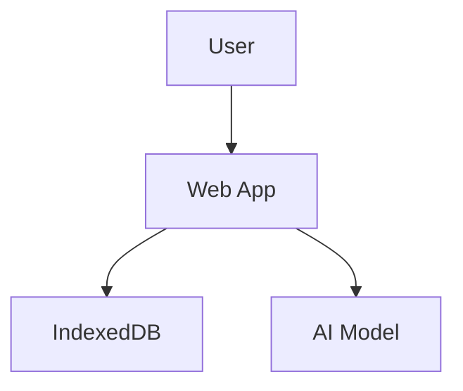

# Genesis Customization Guide

**Purpose**: Learn how to customize Genesis templates for your specific needs.

---

## Table of Contents

1. [Template Variables](#template-variables)
2. [Customizing Workflows](#customizing-workflows)
3. [Customizing Web App](#customizing-web-app)
4. [Customizing Scripts](#customizing-scripts)
5. [Customizing Documentation](#customizing-documentation)
6. [Advanced Customization](#advanced-customization)

---

## 1. Template Variables

### Core Variables

All templates use `{{VARIABLE_NAME}}` syntax. Here are the core variables:

```bash
# Project Identity
{{PROJECT_NAME}}                 # e.g., "one-pager-assistant"
{{PROJECT_TITLE}}                # e.g., "One-Pager Assistant"
{{PROJECT_DESCRIPTION}}          # One-line description
{{GITHUB_USER}}                  # GitHub username
{{GITHUB_REPO}}                  # Repository name
{{AUTHOR_NAME}}                  # Author full name
{{AUTHOR_EMAIL}}                 # Author email

# Workflow Configuration
{{WORKFLOW_TYPE}}                # "multi-phase" or "single-phase"
{{PHASE_COUNT}}                  # Number of workflow phases
{{PHASE_1_NAME}}                 # e.g., "Initial Draft"
{{PHASE_1_AI}}                   # e.g., "Claude Sonnet 4.5"
{{PHASE_2_NAME}}                 # e.g., "Review & Critique"
{{PHASE_2_AI}}                   # e.g., "Gemini 2.5 Pro"

# Architecture Flags
{{ENABLE_BACKEND}}               # true/false
{{ENABLE_DESKTOP_CLIENTS}}       # true/false
{{ENABLE_CODECOV}}               # true/false
{{ENABLE_PRE_COMMIT_HOOKS}}      # true/false

# Deployment
{{GITHUB_PAGES_URL}}             # e.g., "https://user.github.io/repo"
{{DEPLOY_BRANCH}}                # e.g., "main"
{{DEPLOY_FOLDER}}                # e.g., "docs" or "web"

# Storage
{{STORAGE_TYPE}}                 # "indexeddb", "localstorage", "backend"
{{DB_NAME}}                      # IndexedDB database name
{{STORE_NAME}}                   # IndexedDB store name
```

### Adding Custom Variables

1. **Define in config.json**:
   ```json
   {
     "custom": {
       "my_variable": "my_value"
     }
   }
   ```

2. **Use in templates**:
   ```html
   <title>{{MY_VARIABLE}}</title>
   ```

3. **Document in this file** so AI knows about it

---

## 2. Customizing Workflows

### Change Number of Phases

**Example**: Convert 3-phase PRD workflow to 2-phase One-Pager workflow

**Step 1**: Edit `config.json`:
```json
{
  "workflow": {
    "type": "multi-phase",
    "phases": [
      {
        "number": 1,
        "name": "Initial Draft",
        "ai_model": "Claude Sonnet 4.5",
        "prompt_file": "prompts/phase1.txt"
      },
      {
        "number": 2,
        "name": "Review & Score",
        "ai_model": "Claude Sonnet 4.5",
        "prompt_file": "prompts/phase2.txt"
      }
    ]
  }
}
```

**Step 2**: Update `templates/web-app/js/workflow-template.js`:
- Change `PHASE_COUNT` from 3 to 2
- Remove phase 3 logic
- Update UI to show 2 phases

**Step 3**: Create prompt templates:
- `prompts/phase1.txt` - Initial draft prompt
- `prompts/phase2.txt` - Review & score prompt

**Step 4**: Update documentation:
- `README-template.md` - Update workflow description
- `ARCHITECTURE-template.md` - Update architecture diagram

---

## 3. Customizing Web App

### Change Branding

**Colors**:
Edit `templates/web-app/css/styles-template.css`:
```css
:root {
  --primary-color: #3b82f6;    /* Change to your brand color */
  --secondary-color: #8b5cf6;  /* Change to your accent color */
}
```

**Logo**:
Edit `templates/web-app/index-template.html`:
```html
<div class="logo">
  
</div>
```

**Title**:
Already uses `{{PROJECT_TITLE}}` variable - just set it in config.

### Change Storage Mechanism

**From IndexedDB to LocalStorage**:

1. Edit `config.json`:
   ```json
   {
     "architecture": {
       "storage_type": "localstorage"
     }
   }
   ```

2. Update `templates/web-app/js/storage-template.js`:
   - Replace IndexedDB calls with localStorage
   - Simplify data structure (localStorage has 5-10MB limit)

**From IndexedDB to Backend API**:

1. Edit `config.json`:
   ```json
   {
     "architecture": {
       "enable_backend": true,
       "storage_type": "backend"
     }
   }
   ```

2. Generate backend templates:
   ```bash
   ./scripts/generate-backend.sh
   ```

3. Update `templates/web-app/js/storage-template.js`:
   - Replace IndexedDB calls with fetch() API calls
   - Add authentication if needed

### Add New Features

**Example**: Add export to PDF

1. **Add library** to `templates/web-app/index-template.html`:
   ```html
   <script src="https://cdnjs.cloudflare.com/ajax/libs/jspdf/2.5.1/jspdf.umd.min.js"></script>
   ```

2. **Add button** to UI:
   ```html
   <button onclick="exportToPDF()">Export to PDF</button>
   ```

3. **Add function** to `templates/web-app/js/export-template.js`:
   ```javascript
   async function exportToPDF() {
     const { jsPDF } = window.jspdf;
     const doc = new jsPDF();
     // Add content...
     doc.save('{{PROJECT_NAME}}.pdf');
   }
   ```

---

## 4. Customizing Scripts

### Add Platform-Specific Dependencies

**Example**: Add Flutter to setup script

Edit `templates/scripts/setup-macos-template.sh`:
```bash
# Add to install_dependencies function
if ! command -v flutter &> /dev/null; then
  log_info "Installing Flutter..."
  brew install flutter
fi
```

### Add Custom Validation

Edit `templates/scripts/validate-template.sh`:
```bash
# Add custom validation function
validate_custom() {
  log_section "Custom Validation"
  
  # Your validation logic here
  if [ ! -f "required-file.txt" ]; then
    die "required-file.txt not found"
  fi
  
  log_success "Custom validation passed"
}

# Add to validation tiers
TEST_TIERS[p1]="dependencies builds_core tests_unit validate_custom"
```

---

## 5. Customizing Documentation

### Add Custom Sections to README

Edit `templates/project-structure/README-template.md`:
```markdown
## Custom Section

Your custom content here.

### Subsection

More custom content.
```

### Add Custom Architecture Diagrams

Edit `templates/docs/architecture/ARCHITECTURE-template.md`:
```markdown
## System Architecture


```

### Add Custom Deployment Guides

Create new file `templates/docs/deployment/CUSTOM-DEPLOYMENT-template.md`:
```markdown
# Custom Deployment Guide

Your deployment instructions here.
```

---

## 6. Advanced Customization

### Conditional Template Sections

Use comments to mark conditional sections:

```html
<!-- IF {{ENABLE_BACKEND}} -->
<div class="backend-section">
  Backend-specific content
</div>
<!-- END IF -->
```

Then in generation script:
```bash
if [ "$ENABLE_BACKEND" = "true" ]; then
  # Keep section
else
  # Remove section
  sed -i '/<!-- IF {{ENABLE_BACKEND}} -->/,/<!-- END IF -->/d' file.html
fi
```

### Multi-Language Support

Add language variable:
```json
{
  "i18n": {
    "default_language": "en",
    "supported_languages": ["en", "es", "fr"]
  }
}
```

Create language files:
```
templates/web-app/i18n/
├── en.json
├── es.json
└── fr.json
```

### Custom Build Process

Create `templates/scripts/build-template.sh`:
```bash
#!/usr/bin/env bash

source "$(dirname "${BASH_SOURCE[0]}")/lib/common.sh"
init_script

log_header "Building {{PROJECT_TITLE}}"

# Your custom build steps
npm run build
go build ./...

log_success "Build complete"
```

---

## Examples

See `examples/` directory for complete customization examples:
- `examples/minimal/` - Minimal customization
- `examples/one-pager/` - Moderate customization
- `examples/full-featured/` - Maximum customization

---

## Tips

1. **Start simple**: Use minimal example first, add features incrementally
2. **Test often**: Validate after each customization
3. **Document changes**: Update README and architecture docs
4. **Version control**: Commit after each working customization
5. **Ask AI**: Use AI assistant to help with complex customizations

---

**Need help?** See `01-AI-INSTRUCTIONS.md` for AI-assisted customization.

