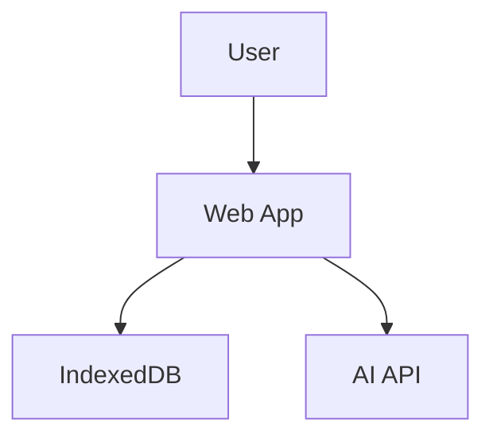

# Architecture Documentation Templates

## Purpose

This directory will contain architecture documentation templates for describing system design, components, and technical decisions.

## Status

⚠️ **Currently Empty** - Architecture templates are planned for Phase 6 of the improvement plan.

## Planned Contents

### 1. ARCHITECTURE-template.md
**Purpose**: High-level system architecture overview

**Sections**:
- System overview
- Component diagram
- Data flow
- Technology stack
- Design principles
- Scalability considerations

### 2. COMPONENTS-template.md
**Purpose**: Detailed component documentation

**Sections**:
- Component list
- Component responsibilities
- Component interactions
- API contracts
- Dependencies

### 3. DATA-FLOW-template.md
**Purpose**: Data flow and state management

**Sections**:
- Data flow diagrams
- State management
- Data persistence
- Data validation
- Error handling

### 4. DECISIONS-template.md
**Purpose**: Architecture Decision Records (ADRs)

**Format**:
```markdown
# ADR-001: Decision Title

## Status
Accepted | Rejected | Superseded

## Context
What is the issue we're facing?

## Decision
What decision did we make?

## Consequences
What are the trade-offs?
```

### 5. DIAGRAMS-template.md
**Purpose**: System diagrams and visualizations

**Includes**:
- Architecture diagrams
- Sequence diagrams
- Entity relationship diagrams
- Deployment diagrams

## Use Cases

Architecture documentation is essential for:

### Onboarding
- Help new developers understand the system
- Explain design decisions
- Show how components interact

### Maintenance
- Document why decisions were made
- Track architectural evolution
- Guide refactoring efforts

### Communication
- Share design with stakeholders
- Facilitate technical discussions
- Document constraints and trade-offs

## Best Practices

### Do's ✅
- Keep diagrams up to date
- Document decisions as they're made
- Explain the "why" not just the "what"
- Use consistent notation
- Include examples

### Don'ts ❌
- Don't document implementation details
- Don't let docs get stale
- Don't skip the "why"
- Don't use jargon without explanation
- Don't forget to update diagrams

## Diagram Tools

Recommended tools for creating diagrams:

### Mermaid (Recommended)
- Text-based diagrams
- Version control friendly
- Renders in GitHub
- No external tools needed



### Draw.io
- Visual diagram editor
- Export to SVG/PNG
- Free and open source

### Excalidraw
- Hand-drawn style
- Simple and intuitive
- Export to SVG/PNG

## Related Documentation

- **Documentation Templates**: `../README.md`
- **Quality Standards**: `../../../05-QUALITY-STANDARDS.md`
- **AI Instructions**: `../../../01-AI-INSTRUCTIONS.md`

## Timeline

Architecture templates will be created in **Phase 6** of the improvement plan (estimated 2-3 hours).

## Contributing

To add architecture templates:
1. Create template file with `-template.md` suffix
2. Add template variables
3. Include example diagrams
4. Update this README
5. Update `../../../SUMMARY.md`

